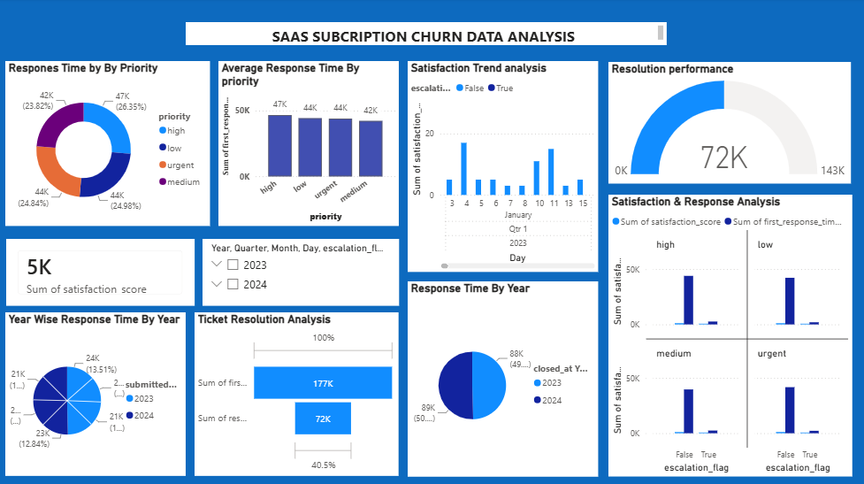

# 📊 SaaS Subscription Churn & Customer Support Analysis – Power BI

## 📌 Project Overview

This project focuses on analyzing SaaS Subscription and Churn Data using Microsoft Power BI.

The dashboard provides interactive insights into customer satisfaction, response time, ticket resolution, priority levels, escalation status, and yearly performance.

## 🎯 Objectives

- Analyze customer support response time.
- Compare response time across different priority levels.
- Analyze customer satisfaction trends.
- Evaluate ticket resolution performance.
- Compare yearly response time and performance.
- Understand the relationship between escalation and satisfaction.
- Generate meaningful business insights using data visualization.

## 🛠️ Tools & Technologies

- Microsoft Power BI
- Power Query
- DAX
- Data Cleaning
- Data Transformation
- Data Visualization

## 📊 Dashboard Features

### Response Time by Priority
Analyzes response time across High, Low, Urgent, and Medium priority levels.

### Average Response Time by Priority
Compares the average response time for different ticket priorities.

### Satisfaction Trend Analysis
Shows customer satisfaction trends over time.

### Resolution Performance
Displays overall ticket resolution performance using a gauge chart.

### Satisfaction & Response Analysis
Analyzes customer satisfaction and response time based on priority and escalation status.

### Year Wise Response Time
Compares response time performance across different years.

### Ticket Resolution Analysis
Provides insights into first response and ticket resolution performance.

## 📈 Key Insights

- Response time varies across different priority levels.
- Customer satisfaction can be analyzed based on escalation status.
- Year-wise analysis helps identify changes in support performance.
- Ticket resolution metrics provide insights into customer support efficiency.
- Priority-based analysis helps identify areas that require faster responses.

## 🔄 Project Workflow

1. Data Collection
2. Data Cleaning
3. Data Transformation using Power Query
4. Data Modeling
5. DAX Calculations
6. Dashboard Development
7. Data Visualization
8. Insight Generation

## 🖼️ Dashboard Preview

## 📝 Conclusion

This Power BI dashboard provides an interactive view of SaaS subscription and customer support data. It helps analyze response time, customer satisfaction, ticket resolution, priority, and escalation patterns for better data-driven decision making.

## 👩‍💻 Author

**Iniya S**

B.Sc. Computer Science with Data Science

**Skills:** Power BI | SQL | Python | Excel | Data Analysis | Data Visualization
